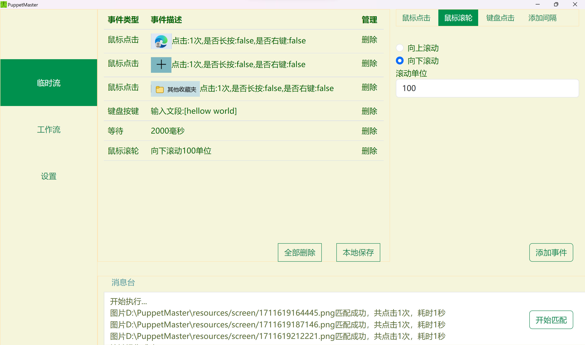

# PuppetMaster
A desktop application that allows users to customize keyboard and mouse scripts.

PuppeteMaster是一款Windows系统下的桌面应用程序，主要实现无代码创建键鼠脚本，支持图色匹配点击，键盘输入，组合键，滚轮操作，并且用户可以自定义选项并将其组合执行，也可以保存为脚本文件(.json格式)，从外部导入进行编辑。

---
## 应用场景
1. 模拟日常工作流程
2. 桌面游戏日常脚本
3. 重复性工作(批量处理)
4. 抢票，抢优惠券

---
## 功能演示


---
## 如何安装并使用
1. 下载目录下的**PuppetMasterInstaller.exe**安装包，然后安装
2. 安装完成后打开PuppetMaster.exe，在临时流中可以通过右侧的添加事件构建你的临时工作流，在工作流中用户可以打开本地保存的.json文件，这里面储存了事件流的信息，可以进行编辑或执行。设置界面可以进行清除截图缓存操作(谨慎选择)。

---
## 在工程环境下打开
1. 将本仓库clone到本地
2. 解压opencv.zip到当前目录
3. 在项目目录下，执行
```npm install```
  安装项目依赖,如果失败，请参考[文章](https://juejin.cn/post/7344572677393629222)
 
4. 对依赖进行重构(参考上面的文章)
5. 执行
   ```npm run start```
6. PuppetMaster使用Electron Forge进行打包,如需打包请执行```npm run make```

---
## 说明
1. 该项目使用electron+robotjs+opencv4nodejs集成开发。
2. 使用版本号``` "@u4/opencv4nodejs": "^6.5.3",
              "robotjsfix": "^0.6.1",
               "electron": "^20.0.0"```
3. 仅为学习学习项目，不用做商用。
4. PuppetMaster在执行的描点在桌面最上层,因此无法后台操作，但是可以通过windows系统的多桌面功能进行后台操作。
